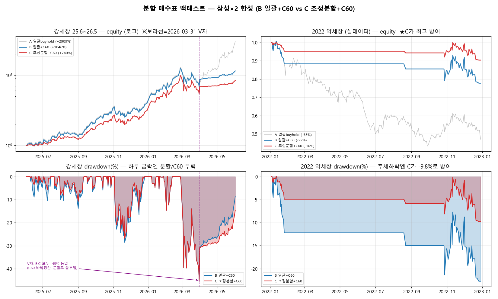
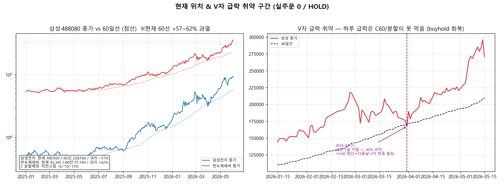

# 레버리지 분할 매수표 (확정) — 2026-06-03

> **결정자**: 퐝가님 / **상태**: shadow only (실주문 0 / 봇 OFF / HOLD)
> **기본형 = C 조정분할 + C60** / B 일괄+C60 = 공격형 비교선(shadow 유지)

## 1. 결정 요약

| 구분 | 확정 |
|------|------|
| 기본 분할표 | **C 조정분할 + C60** |
| 공격형 비교선 | B 일괄 + C60 (shadow에만 유지, forward 추적) |
| 국면 판단(hard gate) | **C60 단독** (close vs MA60) — `src/etf/regime_monitor.py` |
| 약세전환 시 | C60 이탈 → 전량 청산 → **현금 대기** |
| 운용 | 실주문 0 / HOLD / B·C 둘 다 forward 추적 후 실차이 검증 |

## 2. 분할 매수표 (C 기본형)

대상: 488080(반도체레버) / 005930 삼성 단일레버(0193W0) / 000660 SK 단일레버(0193T0) — 각 자기 60일선으로 개별 국면 판단.

| 트랜치 | 진입 조건 (BULL 국면 한정) | 투입 비중 | 누적 |
|--------|---------------------------|-----------|------|
| T1 기본 | BULL 확인 즉시 | 30% | 30% |
| T2 조정 | 직전 고점 대비 −5% | 20% | 50% |
| T3 조정 | 직전 고점 대비 −10% | 20% | 70% |
| T4 조정 | 직전 고점 대비 −15% | 30% | 100% |
| **BEAR 전환** | **신규 진입 전면 중단 / 60선 이탈 시 전량 청산 → 현금 대기** | — | — |

- 비용 가정 0.1%/거래, look-ahead 0(전일 종가 신호 → 당일 적용).
- 재진입: BEAR→BULL 복귀 시 T1부터 재시작.
- 파라미터(30/20/20/30, −5/−10/−15%)는 미세조정 미검증 → forward로 재검증.

## 3. 백테스트 근거 (`scripts/research/split_buy_backtest.py`)

| 구간 | A 일괄buyhold | B 일괄+C60 | **C 조정분할+C60** |
|------|--------------|-----------|-------------------|
| 강세장 삼성×2 (25.6~26.5) | +2909% / −45% | +1046% / −45% | **+740% / −45%** |
| 약세장 삼성×2 (2022 실데이터) | −53% / −57% | −22% / −23% | **−9.6% / −9.8%** |

**핵심 통찰**: 분할/C60의 가치는 **하락 속도**에 의존.
- 강세장 V자(하루 급락, 2026-03-31) → C60·분할 모두 무력(MDD 동일 −45%). C60가 바닥에서 청산해 오히려 손해.
- 추세 약세장(2022) → C60·분할 강력(MDD −57%→−9.8%). 조정분할이 천천히 투입 + C60 청산으로 비대칭 입증.

## 3-1. SHOW ME 리포트 (그래프) — `scripts/research/split_buy_report.py`

숫자만 남기지 않고 그림으로 박아 다음 세션이 바로 눈으로 판단한다.

**백테스트 — B 일괄+C60 vs C 조정분할+C60 (equity / drawdown × 강세장 / 2022 약세장)**

- 좌상 강세장 equity(로그): A 일괄 압도(+2909%), C는 +740%(보험료). 보라선=2026-03-31 V자.
- 우상 2022 약세장 equity: **C가 −9.6%로 최고 방어** (A −53%).
- 좌하 강세장 drawdown: **V자에서 B·C 모두 −45% 동일** (C60 바닥청산, 분할도 풀투입 → 무력).
- 우하 약세장 drawdown: 추세 하락엔 **C가 −9.8%로 방어** (B −23%).

**현재 위치 & V자 급락 취약 구간**

- 좌: 삼성 현재 360,500 / 60선 229,743 / **괴리 +57%**, 488080 / **+62%** = 과열. 점선=C 분할 예정가(−5/−10/−15%).
- 우: 2026-03-31 60선 1일 이탈(−45% 바닥) → C60 청산 → 다음날 V자 반등 놓침. **하루 급락은 C60/분할이 못 막음(buyhold가 회복).**

## 4. C 선택 이유 (B 대비)

1. **진입 위치가 과열** — 60선 대비 괴리 삼성 +57% / 488080 +62%. 지금 일괄(B) 진입은 고점 평단 + V자 −45% 전액 직격.
2. **꼭지 리스크 실재** — 미중규제 2027+ 갱신거부 / 외국인 84조 매도(고점분산) / 단일레버 첫날 2조 쏠림.
3. **분할표 취지** — 과열 구간에서 평단·심리 방어(SK 공포매도 교훈 = 규칙으로 심리 대체).
4. **비대칭** — thesis 맞아도 +740%(충분), 틀려도 −9.6%(최소).
   단, 강세 100% 확신 + 과열 감수 시 B가 +306%p 우위(공격형 비교선으로 보존).

## 5. 다음 작업

- **forward shadow에 B·C 병렬 추적** 통합 (매일 국면 + 트랜치 상태 + equity 기록, 실주문 0).
- 보조 게이트 후보(KOSPI 60선 이탈, 삼성 precision 0.53)는 계속 로그 관찰 — 승격 판단은 `regime_obs_adversarial.py`.
- 한계: 약세장 표본 2022 1개 / 강세장 V자 2026-03-31 1회 / 분할 파라미터 미세조정 미검증.
