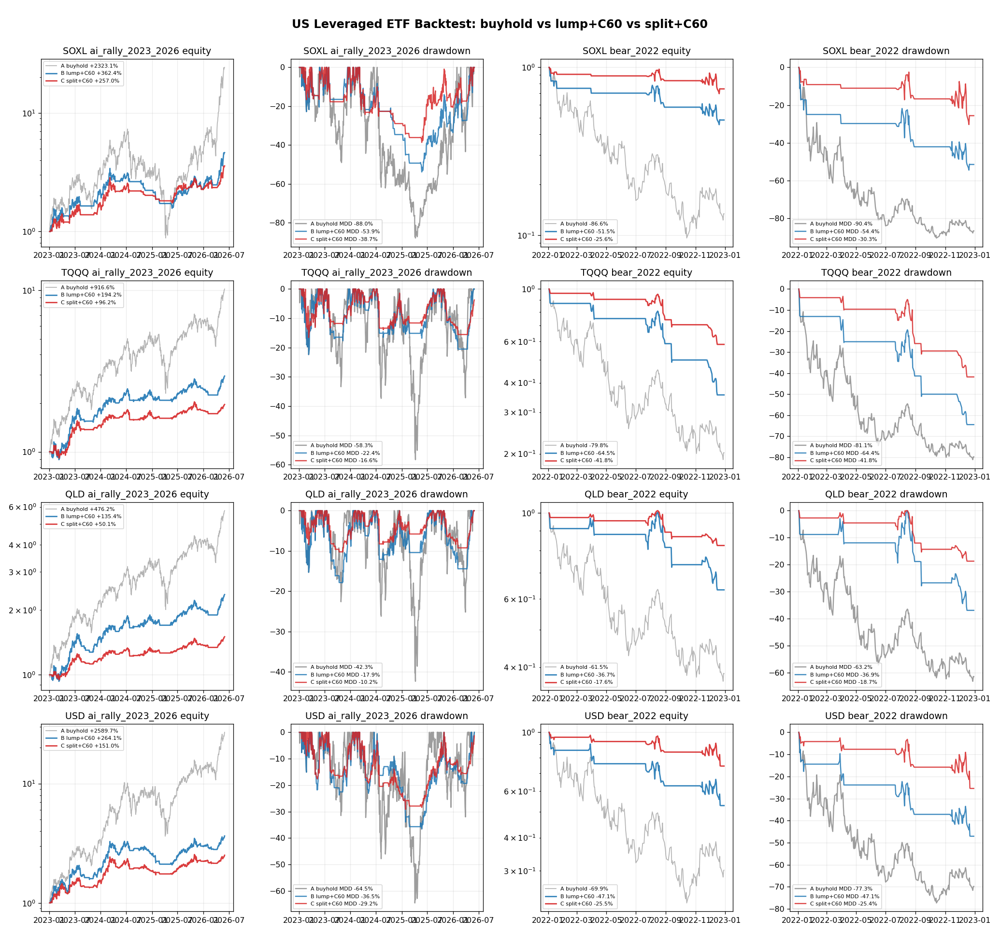

# US Leverage C60 Split-Buy SHOW ME

- Scope: SOXL, TQQQ, QLD, USD
- Price basis: actual leveraged ETF close
- Primary signal basis: leveraged ETF self close > MA60, applied from next observed trading day
- Sensitivity: benchmark ETF close > MA60 is also stored because benchmark signals can lag leveraged products in crashes.
- Safety: real orders 0 / HOLD / read-only / scheduler untouched

## Summary

| Ticker | Benchmark | Signal | Window | A buyhold | B lump+C60 | C split+C60 |
|---|---|---|---|---:|---:|---:|
| SOXL | SOXX | self_c60 | ai_rally_2023_2026 | +2323.1% / -88.0% | +362.4% / -53.9% | +257.0% / -38.7% |
| SOXL | SOXX | self_c60 | bear_2022 | -86.6% / -90.4% | -51.5% / -54.4% | -25.6% / -30.3% |
| SOXL | SOXX | benchmark_c60 | ai_rally_2023_2026 | +2323.1% / -88.0% | +486.1% / -56.9% | +305.8% / -51.4% |
| SOXL | SOXX | benchmark_c60 | bear_2022 | -86.6% / -90.4% | -69.3% / -69.3% | -59.6% / -59.6% |
| TQQQ | QQQ | self_c60 | ai_rally_2023_2026 | +916.6% / -58.3% | +194.2% / -22.4% | +96.2% / -16.6% |
| TQQQ | QQQ | self_c60 | bear_2022 | -79.8% / -81.1% | -64.5% / -64.4% | -41.8% / -41.8% |
| TQQQ | QQQ | benchmark_c60 | ai_rally_2023_2026 | +916.6% / -58.3% | +248.2% / -24.8% | +132.1% / -22.1% |
| TQQQ | QQQ | benchmark_c60 | bear_2022 | -79.8% / -81.1% | -51.5% / -51.4% | -36.5% / -36.5% |
| QLD | QQQ | self_c60 | ai_rally_2023_2026 | +476.2% / -42.3% | +135.4% / -17.9% | +50.1% / -10.2% |
| QLD | QQQ | self_c60 | bear_2022 | -61.5% / -63.2% | -36.7% / -36.9% | -17.6% / -18.7% |
| QLD | QQQ | benchmark_c60 | ai_rally_2023_2026 | +476.2% / -42.3% | +164.7% / -17.5% | +83.3% / -15.4% |
| QLD | QQQ | benchmark_c60 | bear_2022 | -61.5% / -63.2% | -36.9% / -36.9% | -22.1% / -22.1% |
| USD | SOXX | self_c60 | ai_rally_2023_2026 | +2589.7% / -64.5% | +264.1% / -36.5% | +151.0% / -29.2% |
| USD | SOXX | self_c60 | bear_2022 | -69.9% / -77.3% | -47.1% / -47.1% | -25.5% / -25.4% |
| USD | SOXX | benchmark_c60 | ai_rally_2023_2026 | +2589.7% / -64.5% | +353.8% / -26.6% | +206.4% / -19.2% |
| USD | SOXX | benchmark_c60 | bear_2022 | -69.9% / -77.3% | -54.8% / -54.8% | -43.1% / -43.1% |

## Read

- Bull regimes reward buyhold, especially 3x products.
- 2022 stress shows why unhedged 2x/3x can destroy capital.
- For actual US leveraged ETFs, self C60 is the primary backtest basis.
- Benchmark C60 is useful as a sensitivity check, but it can exit late in leverage crashes.
- C split-buy is not a V-shaped crash shield. It is a trend-bear survival rule.
- Macro early-warning signals should be validated separately before becoming hard gates.
